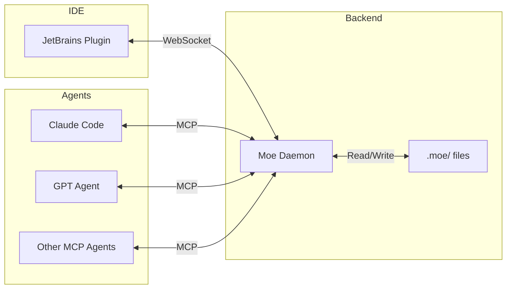

```
                             __  __            _        _____
                            |  \/  | ___   ___( )___   |_   _|_ ___   _____ _ __ _ __
                            | |\/| |/ _ \ / _ \// __|    | |/ _` \ \ / / _ \ '__| '_ \
                            | |  | | (_) |  __/ \__ \    | | (_| |\ V /  __/ |  | | | |
                            |_|  |_|\___/ \___| |___/    |_|\__,_| \_/ \___|_|  |_| |_|
```

<p align="center">
  <strong>AI Workforce Command Center</strong><br>
  Human oversight for AI coding agents
</p>

<p align="center">
  <a href="https://yaront1111.github.io/Moe-s-Tavern/"></a>
  <a href="LICENSE"></a>
  <a href="https://github.com/yaront1111/Moe-s-Tavern/releases"></a>
  <a href="https://github.com/yaront1111/Moe-s-Tavern/pulls"></a>
  
</p>

---


## Why Moe?

AI coding agents are powerful but need guardrails. **Moe's Tavern** provides:

- **Visibility** - See what AI agents are doing in a Kanban board
- **Control** - Approve or reject AI plans before code gets written
- **Traceability** - Full audit log of every action
- **Flexibility** - Works with Claude, GPT, and any MCP-compatible agent

> *"Let AI do the coding, but keep humans in the loop."*

---

## Features

| Feature | Description |
|---------|-------------|
| **Kanban Board** | Visual task management in your IDE |
| **Plan Approval** | Review AI implementation plans before execution |
| **Multi-Agent** | Run architect, worker, and reviewer agents |
| **MCP Protocol** | Standard interface for AI agent integration |
| **Real-time Sync** | Live updates via WebSocket |
| **Activity Log** | Complete audit trail with log rotation |
| **Rails System** | Define constraints AI must follow |

---


## Quick Start

### Prerequisites

- **Node.js 18+** - [Download](https://nodejs.org/)
- **JetBrains IDE** (optional) - For visual Kanban board

### Installation

**Windows:**
```powershell
git clone https://github.com/yaront1111/Moe-s-Tavern.git
cd Moe-s-Tavern
.\scripts\install-all.ps1
```

**Mac (Homebrew):**
```bash
brew tap yaront1111/moe
brew install moe
```

**Mac / Linux (from source):**
```bash
git clone https://github.com/yaront1111/Moe-s-Tavern.git
cd Moe-s-Tavern
chmod +x scripts/*.sh
./scripts/install-mac.sh
```

### Initialize a Project

```bash
# Navigate to your project and initialize
cd /path/to/your/project
moe-daemon init

# Or specify the path explicitly
moe-daemon init --project /path/to/project --name "My Project"
```

This creates the `.moe/` folder structure with project settings and starts the daemon.
Stop it with `Ctrl+C` or `moe-daemon stop --project /path/to/project` if you only want initialization.

### Run Your First Agent

```bash
# Windows
.\scripts\moe-agent.ps1 -Role architect -Project "C:\your\project"

# Mac / Linux
./scripts/moe-agent.sh --role architect --project /your/project
```

The agent will:
1. Connect to the daemon
2. Claim a task from the board
3. Submit a plan for your approval
4. Execute the plan step-by-step

---

## JetBrains Plugin Installation

The plugin provides a visual Kanban board inside your IDE (IntelliJ IDEA, PyCharm, WebStorm, etc.)

### Prerequisites

- **JDK 17+** - [Download](https://adoptium.net/)
- **JetBrains IDE** - Any 2024.1+ version

### Build the Plugin

The plugin bundles the daemon, proxy, agent scripts, and role documentation. Build the daemon and proxy first:

**Mac / Linux:**
```bash
cd packages/moe-daemon && npm install && npm run build
cd ../moe-proxy && npm install && npm run build
cd ../../moe-jetbrains
./gradlew buildPlugin
```

**Windows:**
```powershell
cd packages\moe-daemon; npm install; npm run build
cd ..\moe-proxy; npm install; npm run build
cd ..\..\moe-jetbrains
.\gradlew.bat buildPlugin
```

The plugin zip will be created at `moe-jetbrains/build/distributions/moe-jetbrains-*.zip`

### Install in Your IDE

**Option 1: Install from Disk (Recommended)**

1. Open your JetBrains IDE
2. Go to **Settings/Preferences** → **Plugins**
3. Click the **⚙️ gear icon** → **Install Plugin from Disk...**
4. Select the zip file from `moe-jetbrains/build/distributions/`
5. Restart the IDE

**Option 2: Development Mode**

Run the plugin in a sandbox IDE for testing:
```bash
cd moe-jetbrains
./gradlew runIde    # Mac/Linux
.\gradlew.bat runIde  # Windows
```

### Plugin Location (Manual Install)

If you prefer to extract manually:

| OS | Plugin Directory |
|----|------------------|
| **Windows** | `%APPDATA%\JetBrains\<IDE><version>\plugins\` |
| **Mac** | `~/Library/Application Support/JetBrains/<IDE><version>/plugins/` |
| **Linux** | `~/.config/JetBrains/<IDE><version>/plugins/` |

Extract the zip contents to a `moe-jetbrains` folder in the plugins directory, then restart your IDE.

### Using the Plugin

1. Open a project in your JetBrains IDE
2. The Moe tool window appears in the right sidebar
3. The plugin auto-starts the daemon (bundled with the plugin) and connects
4. Create epics and tasks using the toolbar buttons
5. AI agents will claim tasks and submit plans for your approval

---

## Architecture



**Key Principle:** The `.moe/` folder is the source of truth. The daemon is the sole writer. All clients (plugin, agents) communicate through the daemon.

---

## Project Structure

```
moe/
├── packages/
│   ├── moe-daemon/      # Node.js daemon (TypeScript)
│   └── moe-proxy/       # MCP stdio proxy for agents
├── moe-jetbrains/       # JetBrains IDE plugin (Kotlin)
├── docs/                # Documentation
│   ├── ARCHITECTURE.md  # System design
│   ├── MCP_SERVER.md    # MCP tool reference
│   ├── SCHEMA.md        # Data schema
│   ├── DEVELOPMENT.md   # Dev guide
│   ├── TROUBLESHOOTING.md # Common issues & solutions
│   └── roles/           # Agent role guides (bundled with plugin)
│       ├── architect.md
│       ├── worker.md
│       └── qa.md
└── scripts/             # Agent launcher & install scripts
    ├── moe-agent.ps1    # Windows agent launcher
    ├── moe-agent.sh     # Mac/Linux agent launcher
    └── install-all.ps1  # Windows full install
```

---

## Agent Roles

| Role | Purpose | Claims Tasks In |
|------|---------|-----------------|
| **Architect** | Creates implementation plans | PLANNING status |
| **Worker** | Executes approved plans | WORKING status |
| **Reviewer** | QA and code review | REVIEW status |

---

## Approval Modes

Configure in `.moe/project.json`:

| Mode | Behavior |
|------|----------|
| **CONTROL** | Manual approval required (default) |
| **SPEED** | Auto-approve after delay (configurable) |
| **TURBO** | Instant auto-approve |

---

## Documentation

- [Architecture Overview](docs/ARCHITECTURE.md)
- [MCP Server API](docs/MCP_SERVER.md)
- [Data Schema](docs/SCHEMA.md)
- [Development Guide](docs/DEVELOPMENT.md)
- [Troubleshooting](docs/TROUBLESHOOTING.md)

---

## Contributing

Contributions are welcome! Please:

1. Fork the repository
2. Create a feature branch (`git checkout -b feature/amazing`)
3. Commit your changes (`git commit -m 'Add amazing feature'`)
4. Push to the branch (`git push origin feature/amazing`)
5. Open a Pull Request

See [CONTRIBUTING.md](CONTRIBUTING.md) for detailed guidelines.

---

## License

MIT License - see [LICENSE](LICENSE) for details.

---

<p align="center">
  <em>"Welcome to Moe's Tavern - where AI agents come to get their work done!"</em>
</p>
