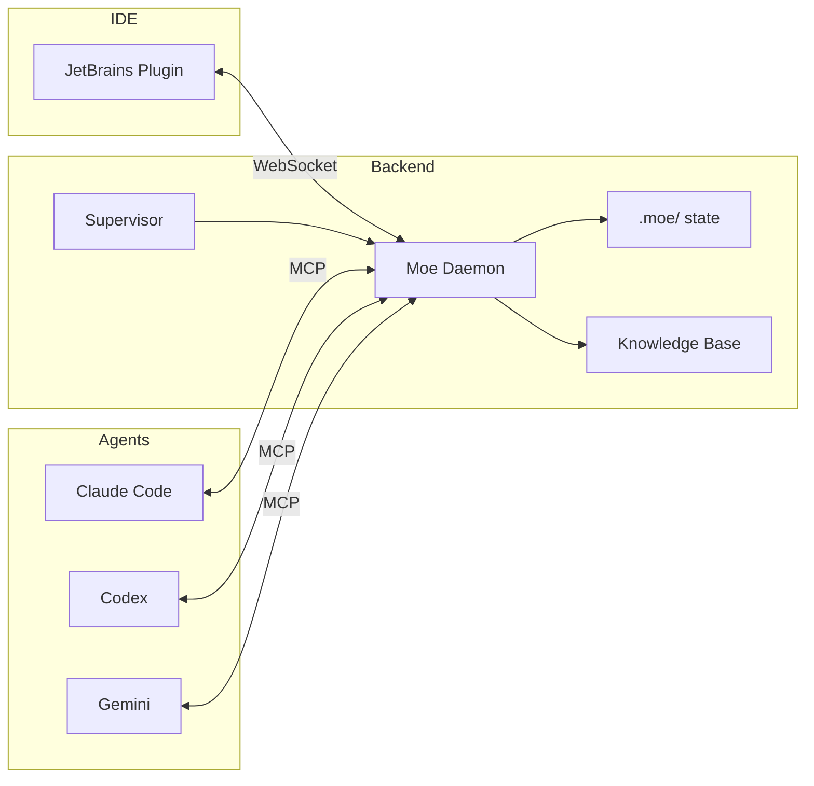
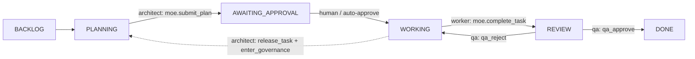

```
                             __  __            _        _____
                            |  \/  | ___   ___( )___   |_   _|_ ___   _____ _ __ _ __
                            | |\/| |/ _ \ / _ \// __|    | |/ _` \ \ / / _ \ '__| '_ \
                            | |  | | (_) |  __/ \__ \    | | (_| |\ V /  __/ |  | | | |
                            |_|  |_|\___/ \___| |___/    |_|\__,_| \_/ \___|_|  |_| |_|
```

<p align="center">
  <strong>AI Workforce Command Center</strong><br>
  Human oversight for AI coding agents
</p>

<p align="center">
  <a href="https://yaront1111.github.io/Moe-s-Tavern/"></a>
  <a href="LICENSE"></a>
  <a href="https://github.com/yaront1111/Moe-s-Tavern/releases"></a>
  <a href="https://github.com/yaront1111/Moe-s-Tavern/pulls"></a>
  
</p>

---


## Why Moe?

AI coding agents are powerful but need guardrails. **Moe's Tavern** provides:

- **Visibility** - See what AI agents are doing in a Kanban board
- **Control** - Approve or reject AI plans before code gets written
- **Persistent Memory** - Agents learn from every task and share knowledge across sessions
- **Self-Healing** - Daemon auto-restarts on crash with exponential backoff
- **Traceability** - Full audit log of every action
- **Agent Chat** - Agents communicate, coordinate, and share context in real-time
- **Skills System** - Vendored 8-phase discipline (TDD, debugging, adversarial review, regression checks) injected into every agent session
- **Governance Mode** - Architects can pause a running task to revise rails, then hand it back
- **Branch Safety** - Agents are blocked from auto-committing to `main` and peel onto a dated worker branch
- **Flexibility** - Works with Claude, Codex, Gemini, and any MCP-compatible agent

> *"Let AI do the coding, but keep humans in the loop."*

---

## Features

| Feature | Description |
|---------|-------------|
| **Kanban Board** | Visual task management in your IDE (JetBrains + VS Code) |
| **Plan Approval** | Review AI implementation plans before execution |
| **Persistent Memory** | Project knowledge base with BM25 search that grows with every task ([details](docs/MEMORY.md)) |
| **Skills System** | 11 vendored skills (planning, TDD, systematic-debugging, adversarial-self-review, regression-check, receiving-code-review, …) auto-loaded per role ([manifest](docs/skills/manifest.json)) |
| **Governance Mode** | Architect can `release_task` + `enter_governance` to revise rails on a live task, then hand it back to a worker |
| **Branch Safety** | Wrapper post-flight refuses to commit on `main`/`master` and peels onto `moe/work-<date>` automatically |
| **Self-Healing Daemon** | Supervisor auto-restarts on crash with exponential backoff |
| **Runtime-Driven Workflow** | Per-task agent respawn, streaming output, trimmed prompts — long sessions stay responsive |
| **Agent Chat** | Real-time messaging with @mentions, channels, and a Mention Response Protocol that forces tagged agents to reply |
| **Multi-Agent** | Architect, worker, and QA roles across Claude, Codex, Gemini, and any MCP-compatible agent |
| **MCP Protocol** | 50+ tools including `release_task`, `enter_governance`, `list_workers`, `propose_rail`, memory (`recall`/`remember`/`reflect`), chat, teams |
| **Real-time Sync** | Live updates via WebSocket |
| **Activity Log** | Complete audit trail with log rotation |
| **Rails System** | Forbidden / required patterns enforced on plans; architects can `propose_rail` for human review |
| **Teams** | Launch parallel agent teams within epics |

---


## Quick Start

### Prerequisites

- **Node.js 18+** - [Download](https://nodejs.org/)
- **JetBrains IDE** (optional) - For visual Kanban board

### Installation

**Windows:**
```powershell
git clone https://github.com/yaront1111/Moe-s-Tavern.git
cd Moe-s-Tavern
.\scripts\install-all.ps1
```

**Mac (Homebrew):**
```bash
brew tap yaront1111/moe
brew install moe
```

**Mac / Linux (from source):**
```bash
git clone https://github.com/yaront1111/Moe-s-Tavern.git
cd Moe-s-Tavern
chmod +x scripts/*.sh
./scripts/install-mac.sh
```

### Initialize a Project

```bash
# Navigate to your project and initialize
cd /path/to/your/project
moe-daemon init

# Or specify the path explicitly
moe-daemon init --project /path/to/project --name "My Project"
```

This creates the `.moe/` folder structure with project settings and starts the daemon.
Stop it with `Ctrl+C` or `moe-daemon stop --project /path/to/project` if you only want initialization.

### Run Your First Agent

```bash
# Windows
.\scripts\moe-agent.ps1 -Role architect -Project "C:\your\project"

# Mac / Linux
./scripts/moe-agent.sh --role architect --project /your/project
```

The agent will:
1. Connect to the daemon and load the per-role skills from `.moe/skills/`
2. Claim a task from the board
3. Submit a plan for your approval (architect) or execute steps (worker)
4. Run pre-flight and post-flight checks — including the branch-safety guard that refuses to commit on `main` and peels onto `moe/work-<YYYY-MM-DD>`

Claude-CLI–backed sessions are launched with `--effort max` by default. The agent process respawns per task so prompt size and memory stay bounded across long runs.

### Run a Full Team

Launch architect + worker + QA agents in parallel:

```bash
# Windows
.\scripts\moe-team.ps1 -Project "C:\your\project"

# Mac / Linux
./scripts/moe-team.sh --project /your/project
```

---

## JetBrains Plugin Installation

The plugin provides a visual Kanban board inside your IDE (IntelliJ IDEA, PyCharm, WebStorm, etc.)

### Prerequisites

- **JDK 17+** - [Download](https://adoptium.net/)
- **JetBrains IDE** - Any 2024.1+ version

### Build the Plugin

The plugin bundles the daemon, proxy, agent scripts, and role documentation. Build the daemon and proxy first:

**Mac / Linux:**
```bash
cd packages/moe-daemon && npm install && npm run build
cd ../moe-proxy && npm install && npm run build
cd ../../moe-jetbrains
./gradlew buildPlugin
```

**Windows:**
```powershell
cd packages\moe-daemon; npm install; npm run build
cd ..\moe-proxy; npm install; npm run build
cd ..\..\moe-jetbrains
.\gradlew.bat buildPlugin
```

The plugin zip will be created at `moe-jetbrains/build/distributions/moe-jetbrains-*.zip`

### Install in Your IDE

**Option 1: Install from Disk (Recommended)**

1. Open your JetBrains IDE
2. Go to **Settings/Preferences** → **Plugins**
3. Click the **⚙️ gear icon** → **Install Plugin from Disk...**
4. Select the zip file from `moe-jetbrains/build/distributions/`
5. Restart the IDE

**Option 2: Development Mode**

Run the plugin in a sandbox IDE for testing:
```bash
cd moe-jetbrains
./gradlew runIde    # Mac/Linux
.\gradlew.bat runIde  # Windows
```

### Plugin Location (Manual Install)

If you prefer to extract manually:

| OS | Plugin Directory |
|----|------------------|
| **Windows** | `%APPDATA%\JetBrains\<IDE><version>\plugins\` |
| **Mac** | `~/Library/Application Support/JetBrains/<IDE><version>/plugins/` |
| **Linux** | `~/.config/JetBrains/<IDE><version>/plugins/` |

Extract the zip contents to a `moe-jetbrains` folder in the plugins directory, then restart your IDE.

### Using the Plugin

1. Open a project in your JetBrains IDE
2. The Moe tool window appears in the right sidebar
3. The plugin auto-starts the daemon (bundled with the plugin) and connects
4. Create epics and tasks using the toolbar buttons
5. AI agents will claim tasks and submit plans for your approval

---

## Architecture


```mermaid
graph LR
    subgraph IDE
        Plugin[JetBrains Plugin]
    end

    subgraph Backend
        Supervisor[Supervisor] --> Daemon[Moe Daemon]
        Daemon --> Files[".moe/ state"]
        Daemon --> Memory["Knowledge Base"]
    end

    subgraph Agents
        Claude[Claude Code]
        Codex[Codex]
        Gemini[Gemini]
    end

    Plugin <-->|WebSocket| Daemon
    Claude <-->|MCP| Daemon
    Codex <-->|MCP| Daemon
    Gemini <-->|MCP| Daemon
```

**Key Principles:**
- The `.moe/` folder is the source of truth. The daemon is the sole writer.
- The **supervisor** auto-restarts the daemon on crash with exponential backoff.
- The **knowledge base** persists agent learnings across sessions with BM25 search and confidence scoring.
- The **skills system** mirrors `.moe/skills/` into each agent's tool path so vendored discipline (TDD, debugging, adversarial review) is always one `Skill` invocation away.
- The agent wrapper (`scripts/moe-agent.*`) runs **pre-flight** (workspace + skill sync) and **post-flight** (branch-safety, commit hygiene) around every claimed task.

---

## Project Structure

```
moe/
├── packages/
│   ├── moe-daemon/      # Node.js daemon (TypeScript)
│   │   └── src/
│   │       ├── knowledge/   # Memory system (BM25, tokenizer, scoring)
│   │       ├── tools/       # 50+ MCP tool implementations
│   │       ├── state/       # State management + file watcher
│   │       └── server/      # WebSocket + MCP adapter
│   └── moe-proxy/       # MCP stdio proxy for agents
├── moe-jetbrains/       # JetBrains IDE plugin (Kotlin)
├── moe-vscode/          # VS Code / Antigravity extension
├── docs/
│   ├── ARCHITECTURE.md  # System design
│   ├── MCP_SERVER.md    # MCP tool reference (50+ tools)
│   ├── SCHEMA.md        # Data schema
│   ├── MEMORY.md        # Memory system guide
│   ├── DEVELOPMENT.md   # Dev guide
│   ├── TROUBLESHOOTING.md
│   ├── skills/          # Vendored agent skills (mirrored into .moe/skills/)
│   │   ├── manifest.json
│   │   ├── moe-planning/, moe-qa-loop/
│   │   ├── test-driven-development/, systematic-debugging/
│   │   ├── adversarial-self-review/, regression-check/
│   │   ├── receiving-code-review/, verification-before-completion/
│   │   ├── explore-before-assume/, writing-plans/
│   │   └── using-git-worktrees/
│   └── roles/
│       ├── architect.md  # Plan mode, governance mode, memory guidance
│       ├── worker.md     # Branch safety, skills usage, mention protocol
│       └── qa.md
└── scripts/             # Agent launcher & install scripts
    ├── moe-agent.sh     # Mac/Linux agent launcher (pre-flight + post-flight)
    ├── moe-agent.ps1    # Windows agent launcher (pre-flight + post-flight)
    ├── moe-team.sh      # Launch full agent team
    └── install-all.ps1  # Windows full install
```

---

## Agent Roles — Architect, Worker, QA

Moe runs every task through a three-role pipeline. Each role claims tasks in a specific status, owns a different MCP toolset, and is wired to its own skill bundle. Humans are the gate between roles (or you can dial that gate down with [Approval Modes](#approval-modes)).


```mermaid
flowchart LR
    BL[BACKLOG] --> PL[PLANNING]
    PL -->|architect: moe.submit_plan| AA[AWAITING_APPROVAL]
    AA -->|human / auto-approve| WK[WORKING]
    WK -->|worker: moe.complete_task| RV[REVIEW]
    RV -->|qa: qa_approve| DN[DONE]
    RV -->|qa: qa_reject| WK
    WK -.->|architect: release_task + enter_governance| PL
```

### 1. Architect — the planner

- Claims `PLANNING` tasks via `moe.claim_next_task {workerId:"architect"}`.
- Explores the codebase, then submits an implementation plan with `moe.submit_plan` (steps, files, rails, DoD).
- Can **propose new rails** with `moe.propose_rail` and route them to humans for approval.
- Can **enter governance mode** on a live task: call `moe.release_task` to detach a stuck worker, then `moe.enter_governance` to revise plan/rails before handing it back.
- Skills auto-loaded: `moe-planning`, `writing-plans`, `explore-before-assume`.
- Role guide: [`docs/roles/architect.md`](docs/roles/architect.md).

### 2. Worker — the coder

- Claims `WORKING` tasks (only after human/auto plan approval).
- Walks the plan with `moe.start_step` → edits/tests → `moe.complete_step` per step.
- Pre-flight syncs the worktree and mirrors skills into the agent's tool path; post-flight enforces **branch safety** (never auto-commit to `main`/`master`, peel onto `moe/work-<YYYY-MM-DD>` instead).
- Finishes with `moe.complete_task` only after running `regression-check` and `adversarial-self-review`.
- Skills auto-loaded: `test-driven-development`, `systematic-debugging`, `adversarial-self-review`, `regression-check`, `verification-before-completion`, `receiving-code-review`.
- Role guide: [`docs/roles/worker.md`](docs/roles/worker.md).

### 3. QA — the reviewer

- Claims `REVIEW` tasks. Reads plan + diff, verifies the Definition of Done, runs tests.
- **PASS** → `moe.qa_approve` (task moves to `DONE`).
- **FAIL** → `moe.qa_reject` with structured `rejectionDetails` so the worker has actionable feedback (task drops back to `WORKING`, never to `BACKLOG`).
- Skill auto-loaded: `moe-qa-loop`.
- Role guide: [`docs/roles/qa.md`](docs/roles/qa.md).

### Cross-cutting

- **Memory** — every role can `moe.recall` / `moe.remember` / `moe.reflect` / `moe.save_session_summary`. The knowledge base persists across sessions with BM25 search.
- **Chat** — agents talk via `moe.chat_send` with @mentions and channels; tagged agents must reply (Mention Response Protocol).
- **Effort** — Claude-CLI agents launch with `--effort max` by default; the agent process respawns per task so prompts stay tight.

---

## Approval Modes

Configure in `.moe/project.json`:

| Mode | Behavior |
|------|----------|
| **CONTROL** | Manual approval required (default) |
| **SPEED** | Auto-approve after delay (configurable) |
| **TURBO** | Instant auto-approve |

---

## Documentation

- [Architecture Overview](docs/ARCHITECTURE.md)
- [MCP Server API](docs/MCP_SERVER.md) - 50+ tools (memory, chat, governance, teams, rails)
- [Memory System](docs/MEMORY.md) - How agent memory works
- [Skills Manifest](docs/skills/manifest.json) - Per-role skill bindings
- [Data Schema](docs/SCHEMA.md)
- [Development Guide](docs/DEVELOPMENT.md)
- [Troubleshooting](docs/TROUBLESHOOTING.md)
- Role guides: [architect](docs/roles/architect.md), [worker](docs/roles/worker.md), [qa](docs/roles/qa.md)

---

## Contributing

Contributions are welcome! Please:

1. Fork the repository
2. Create a feature branch (`git checkout -b feature/amazing`)
3. Commit your changes (`git commit -m 'Add amazing feature'`)
4. Push to the branch (`git push origin feature/amazing`)
5. Open a Pull Request

See [CONTRIBUTING.md](CONTRIBUTING.md) for detailed guidelines.

---

## License

MIT License - see [LICENSE](LICENSE) for details.

---

<p align="center">
  <em>"Welcome to Moe's Tavern - where AI agents come to get their work done!"</em>
</p>
