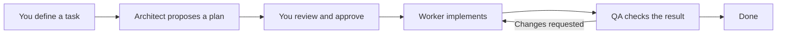

# Moe's Tavern

**An AI agent task board. Turn your coding agents into a team you can steer.**

Run Claude Code, Codex, Gemini CLI, and Grok Build through a shared task board in your IDE. Give agents clear roles, review their plans, and follow the work through implementation and QA.

[](https://github.com/yaront1111/Moe-s-Tavern/actions/workflows/ci.yml)
[](LICENSE)


**[Get started](#get-started) · [See the workflow](#how-it-works) · [Features](#what-you-get) · [Documentation](#documentation)**


*One place to see what is planned, what is being built, and what needs review.*

## Why Moe?

Working with several coding agents means keeping track of their tasks, context, plans, and results. Moe gives that work a shared workflow: you define the outcome, an architect proposes the approach, a worker implements it, and QA checks it against your Definition of Done.

Start with one small task. As you add agents, the same board keeps their plans, progress, conversations, and review feedback together. Choose the coding CLI for each role and decide how much approval you want to retain.

## What you get

| Feature | What it lets you do |
| --- | --- |
| **A live board inside your IDE** | Organize work into epics and tasks, inspect plans and implementation steps, and follow progress from Backlog to Done. JetBrains is the primary interface; a VS Code / Antigravity extension is also included. |
| **Plan approval before implementation** | Review proposed steps and affected files in the default **CONTROL** mode. Choose SPEED or TURBO when you want more automation. |
| **Agents with distinct jobs** | Give planning, implementation, and QA their own roles. Add a governor to help monitor the team and surface blockers. |
| **Your choice of coding CLI** | Launch Claude Code, Codex, Gemini CLI, or Grok Build. Pick different providers for different roles. |
| **Coordination for parallel work** | Use teams, task dependencies, chat channels, and @mentions to coordinate agents. File overlap warnings help flag potential collisions. |
| **Context that survives a session** | Keep tasks, plans, decisions, and handoffs with your project. Add [Serena](docs/MEMORY.md) for shared agent memory across sessions. |
| **Git history tied to tasks** | Agent launchers create task-linked commits, checkpoints, and recovery refs so you can inspect what landed and investigate interrupted work. |
| **Project rules and reusable practices** | Configure project rules (rails) and role guidance. Bundled skills cover planning, testing, debugging, and review; global required and forbidden patterns are checked in submitted plans. |

Moe's daemon and project state run locally, with workflow data stored in `.moe/`. Your coding agents still use their configured providers and accounts. Moe is MIT licensed; provider access and usage are separate.

## How it works

In the default **CONTROL** mode:


```mermaid
flowchart LR
    Task[You define a task] --> Plan[Architect proposes a plan]
    Plan --> Approve[You review and approve]
    Approve --> Build[Worker implements]
    Build --> Review[QA checks the result]
    Review --> Done[Done]
    Review -->|Changes requested| Build
```

| Role | Job |
| --- | --- |
| **Architect** | Explore the project and propose an implementation plan. |
| **Worker** | Implement the approved plan and record verification results. |
| **QA** | Review the result against the Definition of Done; approve it or request changes. |
| **Governor** | Monitor team activity, help resolve coordination problems, and escalate blockers. |

For a first task, ask Moe to document your project's setup and test commands. Review the architect's proposed scope, let the worker write the guide, then inspect QA's findings and the Git diff. Use the same workflow for features, bug fixes, and refactors.

## Get started

The first-run path below uses **JetBrains and one small task**. The [full walkthrough](docs/GETTING_STARTED.md) includes platform details and troubleshooting.

### Install from a marketplace (v0.8.0 and later)

- **JetBrains** — **Settings / Preferences → Plugins → Marketplace**, search for **Moe's Tavern**, install, and restart the IDE.
- **VS Code / Antigravity** — install the extension `yaront1111.moe-vscode` (VS Code Marketplace or Open VSX).
- **Daemon and proxy only** — `npm install -g moe-daemon moe-proxy`, then `moe-daemon init --project .` inside your project (creates `.moe/` and keeps the daemon running in that terminal).

The IDE plugins bundle their own daemon and proxy; the npm packages are for terminal-only use. You still need one coding CLI (Claude Code, Codex, Gemini CLI, or Grok Build) installed and signed in, and Node.js on PATH. After a marketplace install, continue at step 2 below.

> These listings go live with the **v0.8.0** release. Until that tag ships, use **Build from source** below.

### 1. Build from source

Download the [source ZIP](https://github.com/yaront1111/Moe-s-Tavern/archive/refs/heads/main.zip), extract it, and open a terminal in the extracted Moe folder. You can also clone this repository.

**Windows — PowerShell:**

```powershell
powershell -NoProfile -ExecutionPolicy Bypass -File .\scripts\install-all.ps1 -BuildPlugin
```

**macOS / Linux:**

```bash
bash scripts/install-mac.sh --global --skip-mcp --with-plugin
```

The installer sets up Git, Node.js/npm, package dependencies, the daemon and proxy, the selected agent CLI, and JDK 17 for the plugin build. It also builds the JetBrains plugin ZIP. On Linux, it installs tmux for agent terminals. Existing compatible dependencies are reused.

You need a JetBrains IDE and your platform's package manager: **WinGet on Windows**, **Homebrew and Xcode Command Line Tools on macOS**, or **apt/dnf on Linux**. The script may request administrator access when installing system packages. If a prerequisite cannot be installed, it stops with instructions.

**Claude Code is the default.** To choose another bootstrap option, append the corresponding flag:

| Agent | Windows | macOS / Linux |
| --- | --- | --- |
| Codex | `-AgentCommand codex` | `--agent codex` |
| Gemini CLI | `-AgentCommand gemini` | `--agent gemini` |
| Skip agent installation | `-AgentCommand none` | `--agent none` |

Grok Build is supported by the agent launchers. The Windows installer also accepts `-AgentCommand grok`; on macOS/Linux, install Grok Build separately.

Keep the Moe folder after installation. Open a **new terminal**, go to your target project, and run your selected coding CLI once to sign in to your provider account.

### 2. Open the board

1. If you built from source: in JetBrains, open **Settings / Preferences → Plugins → gear icon → Install Plugin from Disk**.
2. Select the ZIP in `moe-jetbrains/build/distributions/` and restart the IDE. (Marketplace installs skip 1–2.)
3. Open **your target Git project**, then open the **Moe** tool window. The plugin initializes `.moe/` and starts the daemon. Wait for **Connected**.

Marketplace builds and the ZIP / `.vsix` attached to each [GitHub Release](https://github.com/yaront1111/Moe-s-Tavern/releases) are built from the release tag. If you built from source, install the plugin you built so it matches your checkout.

### 3. Run your first task

1. Open **Project Settings** and keep **Approval Mode: CONTROL**.
2. Click **+ Epic**, create an epic such as `First task`, then use the **+** in its **Backlog** column to create a task. Give it a clear description and Definition of Done.
3. Drag the task to **Planning**. In **Agents**, choose **Architect**, then your installed CLI. Architects claim tasks in Planning, so a task left in Backlog will wait.
4. When the task shows **Awaiting Approval**, open it, read the plan, and click **Approve**.
5. Launch **Worker** and **QA** from the same menu. Keep their terminals open and follow the task through **Working → Review → Done**.

Open the completed task to inspect its steps, verification results, and QA summary, then review the changed files and recorded commit in Git. By default, the launchers commit task changes and attempt to push them; check any reported Git or verification failure before treating the task as delivered.

Once one task completes, use **Agents → All Agents** to start the team together. If a step stalls, use the [first-task troubleshooting guide](docs/GETTING_STARTED.md#when-a-step-does-not-work).

<details>
<summary>Launch agents from external terminals</summary>

Open a new terminal in the Moe checkout and run one role per terminal. Change `architect` to `worker` or `qa` for the next roles.

**Windows:**

```powershell
powershell -NoProfile -ExecutionPolicy Bypass -File .\scripts\moe-agent.ps1 -Role architect -Project "C:\your\project"
```

**macOS / Linux:**

```bash
./scripts/moe-agent.sh --role architect --project "/your/project"
```

These examples use Claude Code. For Codex, add `-Command codex` on Windows or `--command codex` on macOS/Linux. The launchers configure the agent's Moe connection and start the daemon if needed.

A codex seat runs the interactive terminal UI for every role, and it commits nothing while that UI is open — the launcher records the commit after the CLI exits, so the task can reach **Done** on the board while Git still shows no commit for it. Close the terminal UI and the commit appears; to run a codex seat unattended so it lands a commit per task, add `-CodexExec` on Windows or `--codex-exec` on macOS/Linux (that headless launch has its own sandbox and approval settings — see [`MOE_CODEX_SANDBOX`](docs/CONFIGURATION.md#agent-scripts)).

</details>

<details>
<summary>Use VS Code / Antigravity</summary>

From v0.8.0, install `yaront1111.moe-vscode` from the VS Code Marketplace or Open VSX. To build the [VS Code / Antigravity extension](moe-vscode/README.md) from source instead, run the installer above, then open a new terminal in the Moe folder:

**Windows:**

```powershell
cd moe-vscode
npm.cmd install
npm.cmd run package
```

**macOS / Linux:**

```bash
cd moe-vscode
npm install
npm run package
```

Use **Extensions: Install from VSIX** to install the resulting `.vsix`, open your target project, then run **Moe: Connect to Daemon**. See the extension's README for board commands and connection options. JetBrains is the primary first-run path documented here.

</details>

## Choose your level of control

Set the approval mode in **Project Settings**:

| Mode | Plan approval | Best when |
| --- | --- | --- |
| **CONTROL** — default | You review and approve plans before implementation. | You are getting started or want to inspect each approach. |
| **SPEED** | Plans are automatically approved after a configurable delay, giving you a window to intervene. | You want plans to move forward automatically with a review window. |
| **TURBO** | Submitted plans are automatically approved immediately. | You want autonomous plan approval for a scope you have already defined. |

Agent review and project rules support your workflow. Inspect the results and keep your normal repository checks and merge protections.

## Extend Moe

Moe connects its IDE interfaces and coding agents through a local TypeScript daemon and an MCP proxy. Use the [MCP reference](docs/MCP_SERVER.md) and [architecture guide](docs/ARCHITECTURE.md) to build integrations or understand the runtime.

Customize [role guidance](docs/roles/) and [agent skills](docs/skills/) for your project. Optionally connect [Serena](docs/MEMORY.md) for code navigation and shared memory.

## Documentation

| Start here | Go deeper |
| --- | --- |
| [First task walkthrough](docs/GETTING_STARTED.md) | [Architecture](docs/ARCHITECTURE.md) |
| [Troubleshooting](docs/TROUBLESHOOTING.md) | [MCP tools](docs/MCP_SERVER.md) |
| [Configuration](docs/CONFIGURATION.md) | [Data schema](docs/SCHEMA.md) |
| [Memory and Serena](docs/MEMORY.md) | [Development guide](docs/DEVELOPMENT.md) |
| [Contributing](CONTRIBUTING.md) | [Releasing](docs/RELEASING.md) · [JetBrains Marketplace](docs/MARKETPLACE.md) |

Role guides: [Architect](docs/roles/architect.md) · [Worker](docs/roles/worker.md) · [QA](docs/roles/qa.md) · [Governor](docs/roles/governor.md).

## Contribute

Try Moe on a small task and tell us what worked or got in your way. [Report a bug or request a feature](https://github.com/yaront1111/Moe-s-Tavern/issues), or see the [contribution guide](CONTRIBUTING.md) to help build it.

## License

[MIT](LICENSE).
