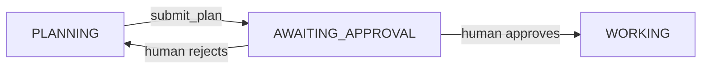
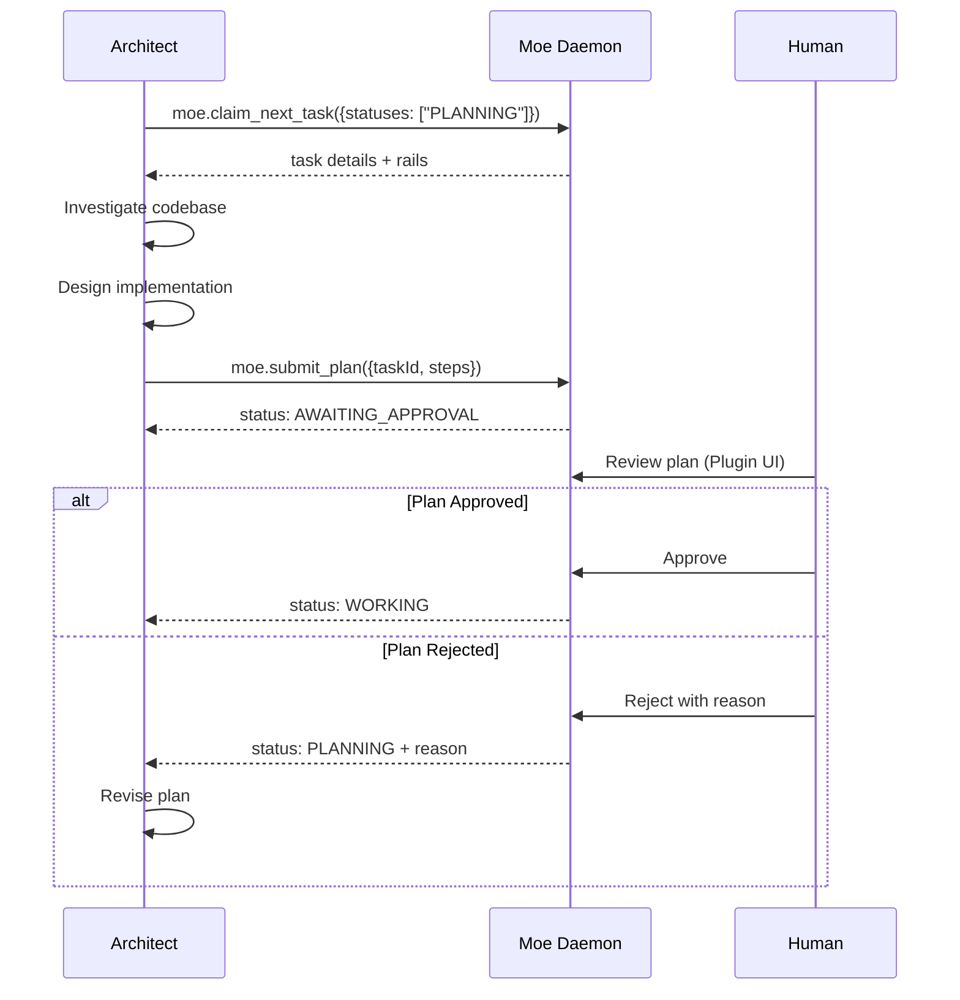

# Architect Agent

The Architect agent is responsible for analyzing tasks and creating detailed implementation plans.

## Role Purpose

- Claim tasks in PLANNING status
- Investigate codebase to understand requirements
- Create step-by-step implementation plans
- Submit plans for human approval

## Status Transitions



## MCP Tools Used

| Tool | Purpose |
|------|---------|
| `moe.claim_next_task` | Claim tasks with `statuses: ["PLANNING"]` |
| `moe.get_context` | Get task details, rails, and constraints |
| `moe.submit_plan` | Submit implementation plan for approval |

## Workflow



## Implementation Plan Format

When creating plans, structure each step as:

```typescript
{
  description: string,      // Clear, actionable description
  affectedFiles: string[]   // Files that will be modified/created
}
```

**Good step example:**
```json
{
  "description": "Add createUser() method to UserService.kt that validates input and saves to database",
  "affectedFiles": ["src/services/UserService.kt", "src/models/User.kt"]
}
```

## Rails Compliance

Before submitting a plan, the architect should:

1. Check `globalRails.forbiddenPatterns` - avoid these
2. Follow `globalRails.requiredPatterns` - include these
3. Respect `epicRails` - epic-level constraints
4. Follow `taskRails` - task-specific guidance

Rails violations cause `moe.submit_plan` to fail with details.

## Example Prompt

```
Role: architect. Always use Moe MCP tools. Start by claiming the next task for your role.

Call moe.claim_next_task {statuses:["PLANNING"]}. If hasNext is false, say: 'No tasks in planning queue' and wait.

When you have a task:
1. Read the task description and Definition of Done carefully
2. Investigate the codebase to understand the current implementation
3. Design a step-by-step implementation plan (3-7 steps typically)
4. Each step should be atomic and have clear affected files
5. Submit the plan with moe.submit_plan

After submitting, check moe.check_approval periodically. If rejected, revise and resubmit.
```

## Tips

- Keep steps atomic - one logical change per step
- List all files that will be touched in `affectedFiles`
- Consider edge cases in your plan
- Reference existing patterns in the codebase
- If unsure about approach, propose a rail change with `moe.propose_rail`
