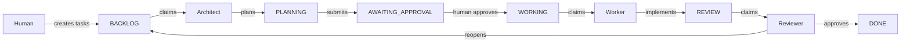

# Moe Agent Roles

This directory contains documentation for each AI agent role that works with the Moe board system.

## Overview

Moe uses a multi-agent workflow where specialized AI agents handle different phases of task completion. Each agent has specific responsibilities and uses dedicated MCP tools.



## Agent Roles

| Role | Status Focus | Primary Action |
|------|--------------|----------------|
| [Architect](./ARCHITECT.md) | PLANNING | Creates implementation plans |
| [Worker](./WORKER.md) | WORKING | Implements approved plans |
| [Reviewer](./REVIEWER.md) | REVIEW | QA, testing, approval |

## Task Status Flow

```
BACKLOG → PLANNING → AWAITING_APPROVAL → WORKING → REVIEW → DONE
                ↑                                      │
                └──────────── (reopen) ────────────────┘
```

## Human Oversight

Humans interact with Moe through:
- **JetBrains Plugin**: Visual board, task creation, plan approval/rejection
- **Direct file editing**: `.moe/tasks/*.json` files

Key human touchpoints:
1. **Task Creation**: Define tasks with clear Definition of Done
2. **Plan Approval**: Review and approve/reject architect plans (AWAITING_APPROVAL)
3. **Final Review**: Optionally review completed work before closing

## Getting Started

1. Start the Moe daemon for your project
2. Configure MCP in your AI CLI (see [MCP_SERVER.md](../MCP_SERVER.md))
3. Run an agent with the appropriate role prompt

See individual role documentation for detailed setup instructions.
