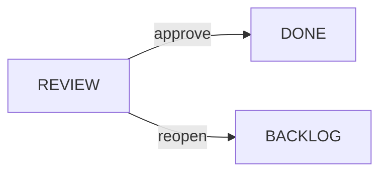
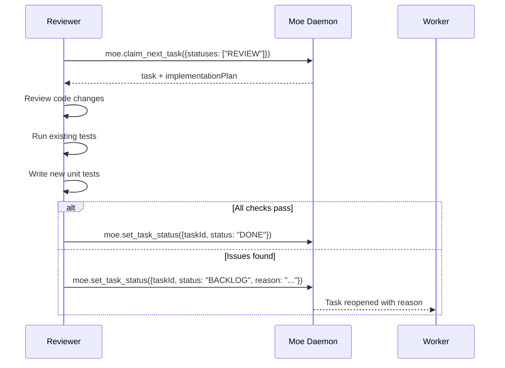

# Reviewer Agent

The Reviewer agent performs QA, writes/runs tests, and approves or reopens completed tasks.

## Role Purpose

- Claim tasks in REVIEW status
- Review implemented code changes
- Run existing tests and write new unit tests
- Approve tasks (move to DONE) or reopen (back to BACKLOG)

## Status Transitions



## MCP Tools Used

| Tool | Purpose |
|------|---------|
| `moe.claim_next_task` | Claim tasks with `statuses: ["REVIEW"]` |
| `moe.get_context` | Get task details and implementation plan |
| `moe.set_task_status` | Set status to DONE or BACKLOG |

## Workflow



## Review Checklist

### Code Review
- [ ] Code matches the implementation plan
- [ ] All Definition of Done criteria met
- [ ] No obvious bugs or logic errors
- [ ] Code follows project patterns/conventions
- [ ] No security vulnerabilities
- [ ] No hardcoded secrets or credentials

### Testing Requirements
- [ ] Existing tests still pass
- [ ] New unit tests cover the changes
- [ ] Edge cases are tested
- [ ] Error handling is tested

### Documentation
- [ ] Code is self-documenting or has comments
- [ ] Public APIs have documentation
- [ ] README updated if needed

## Unit Test Requirements

For each task, the reviewer should ensure:

1. **Coverage**: New code has corresponding unit tests
2. **Assertions**: Tests have meaningful assertions
3. **Edge cases**: Boundary conditions are tested
4. **Error paths**: Error handling is verified

Example test structure:
```kotlin
class UserServiceTest {
    @Test
    fun `createUser validates email format`() {
        // Arrange
        val service = UserService()

        // Act & Assert
        assertThrows<ValidationException> {
            service.createUser("invalid-email", "password")
        }
    }

    @Test
    fun `createUser saves valid user to database`() {
        // ...
    }
}
```

## Approval vs Reopen

**Approve (DONE)** when:
- All Definition of Done criteria are met
- Tests pass and cover the changes
- Code quality is acceptable

**Reopen (BACKLOG)** when:
- Definition of Done not fully met
- Tests fail or are missing
- Significant bugs found
- Security issues discovered

When reopening, always provide a clear reason:

```typescript
moe.set_task_status({
  taskId: "task-abc123",
  status: "BACKLOG",
  reason: "Missing unit tests for error handling in UserService.createUser"
})
```

## Example Prompt

```
Role: reviewer. Always use Moe MCP tools. Start by claiming the next task for your role.

Call moe.claim_next_task {statuses:["REVIEW"]}. If hasNext is false, say: 'No tasks in review queue' and wait.

When you have a task:
1. Read the task description and Definition of Done
2. Review the implementation plan and changed files
3. Run existing tests: [project-specific test command]
4. Write unit tests if missing for new code
5. Check all DoD criteria are met

If all checks pass:
  - Call moe.set_task_status({taskId, status: "DONE"})

If issues found:
  - Call moe.set_task_status({taskId, status: "BACKLOG", reason: "<specific issues>"})
```

## Tips

- Be specific in reopen reasons - help the worker fix issues
- Focus on functionality first, style second
- Don't reopen for minor style issues - note them but approve
- Ensure tests are maintainable, not just present
- Check that the PR (if any) is ready to merge
- Verify no debugging code or console.logs left in
