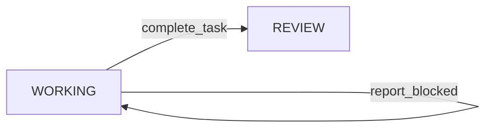
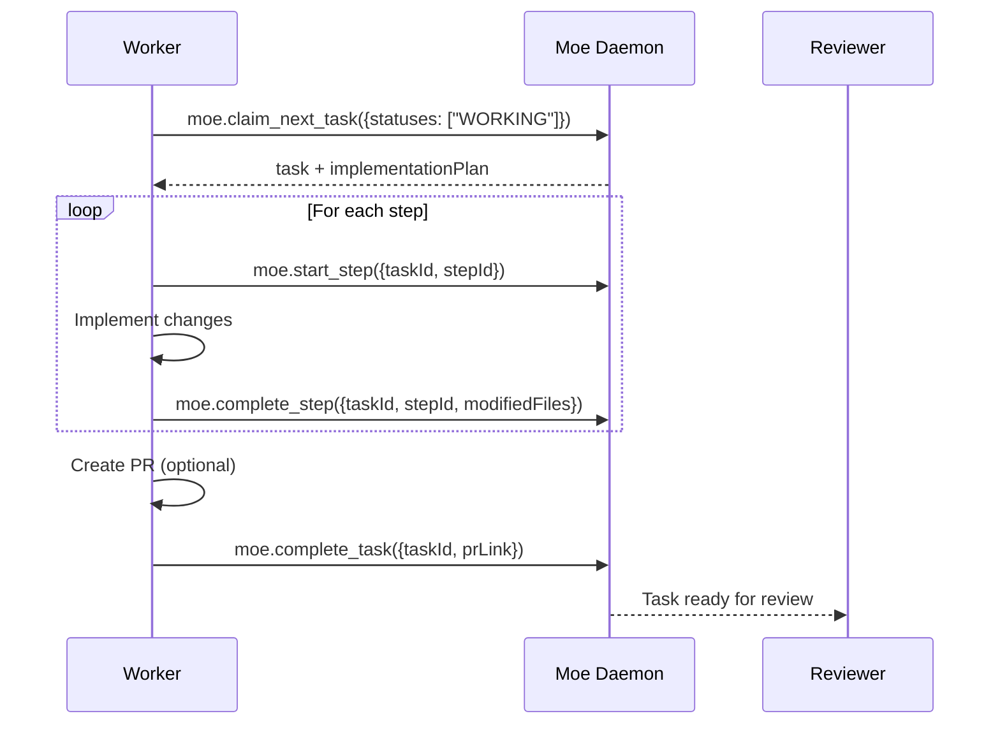

# Worker Agent

The Worker agent implements approved plans by executing each step and tracking progress.

## Role Purpose

- Claim tasks in WORKING status (plans already approved)
- Execute implementation steps in order
- Track progress through each step
- Complete tasks and optionally create PRs

## Status Transitions



## MCP Tools Used

| Tool | Purpose |
|------|---------|
| `moe.claim_next_task` | Claim tasks with `statuses: ["WORKING"]` |
| `moe.get_context` | Get task details and implementation plan |
| `moe.start_step` | Mark a step as IN_PROGRESS |
| `moe.complete_step` | Mark a step as COMPLETED |
| `moe.complete_task` | Mark task as REVIEW (done implementing) |
| `moe.report_blocked` | Report if blocked on something |

## Workflow



## Step Execution

For each step in the implementation plan:

1. **Start**: Call `moe.start_step` to mark as IN_PROGRESS
2. **Implement**: Make the code changes described
3. **Complete**: Call `moe.complete_step` with modified files

```typescript
// Starting a step
moe.start_step({ taskId: "task-abc123", stepId: "step-1" })

// After implementing
moe.complete_step({
  taskId: "task-abc123",
  stepId: "step-1",
  modifiedFiles: ["src/UserService.kt"],
  note: "Added validation logic"
})
```

## Handling Blockers

If you encounter a blocker:

```typescript
moe.report_blocked({
  taskId: "task-abc123",
  reason: "Missing API credentials for external service",
  needsFrom: "DevOps team",
  currentStepId: "step-3"
})
```

## Example Prompt

```
Role: worker. Always use Moe MCP tools. Start by claiming the next task for your role.

Call moe.claim_next_task {statuses:["WORKING"]}. If hasNext is false, say: 'No tasks in worker queue' and wait.

When you have a task:
1. Read the implementation plan carefully
2. For each step:
   a. Call moe.start_step to begin
   b. Implement the changes described
   c. Call moe.complete_step when done
3. After all steps, call moe.complete_task

If you get stuck, use moe.report_blocked to notify the team.
Move completed tasks to REVIEW status.
```

## Tips

- Follow the plan exactly - don't add unrequested features
- Start each step before implementing (tracks progress)
- Include all modified files in `complete_step`
- Test your changes before completing steps
- If the plan seems wrong, propose a rail change rather than deviating
- Create atomic commits that match steps when possible
